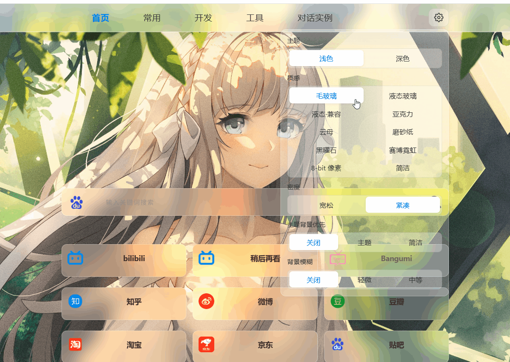

# 个人导航

打开浏览器，就是你自己的起始页。

不用注册、不用服务器、不用装一堆依赖——双击 `index.html` 就能用。站点、搜索引擎、外观都在你自己手里，想怎么摆就怎么摆。



## 它适合谁

- 想把常用网站收成一页，而不是每次在书签栏里翻
- 想换个顺眼的首页，又不想绑定某个在线导航服务
- 想把 Chrome / Edge 里的收藏夹，直接变成同风格的静态页面

## 怎么开始

1. 打开项目文件夹
2. 双击 `index.html`（或用浏览器打开它）
3. 右上角齿轮里改外观；导航内容在 `js/site-data.js` 里改

日常使用就这一步。关掉浏览器再打开，设置还在——都记在本机里。

## 你能改什么

点右上角设置，大部分都能拖一拖、点一点：

| 想调的 | 大概能做什么 |
| --- | --- |
| 浅色 / 深色 | 整体明暗 |
| 质感 | 毛玻璃、液态玻璃、亚克力、云母、纸纹、黑曜石、霓虹、像素…… |
| 密度 | 宽松或紧凑，屏幕小的时候紧凑更省地方 |
| 壁纸相关 | 背景模糊、主题背景优先等 |
| 卡片 | 明暗、透明度，文字和图标不会跟着糊掉 |
| 文字 | 颜色、明暗、阴影、加粗，还有反色增强可读性 |

默认是浅色 + 毛玻璃。不喜欢随时改，改完会自动记住。

### 质感一览

不必全记，逛一遍设置就知道自己喜欢哪个：

- **毛玻璃** — 最稳妥的默认选择
- **液态玻璃** — 更接近 iOS 那一类玻璃感（Chromium 浏览器效果最好）
- **亚克力 / 云母** — 更厚的磨砂，或让壁纸色温透出来
- **磨砂纸** — 铺一层真实纸纹
- **黑曜石** — 深黑 + 冷亮边
- **赛博霓虹 / 8-bit 像素** — 玩票向，换心情用

## 首页搜索

首页中间是搜索框。点左侧图标可以切换百度、Google、Bing 等引擎，回车或点搜索即可。

## 想改上面有哪些网站？

导航分组和链接都在：

```text
js/site-data.js
```

用任意文本编辑器打开，按现有格式增删分类和站点即可。图标放在 `images/` 里，路径写对就能显示。

`common.html`、`develop.html`、`tools.html` 等是其他分页；顶栏会跟着数据一起生成。

## 收藏夹一键变导航页

不想一条条手抄书签的话，用自带的 **Book2HTML**：

1. 进入 `book2html` 文件夹
2. 在地址栏输入 `powershell` 回车（或在此文件夹打开终端）
3. 运行：

```powershell
powershell -ExecutionPolicy Bypass -File .\book2html-server.ps1
```

浏览器会自动打开本地小工具。它会扫描本机 Chrome / Edge / Brave 等浏览器的收藏夹，你勾选需要的文件夹，就能生成同风格的 `bookmarks_xxx.html`，并可选写进顶栏导航。

更细的说明见 [book2html/README.md](book2html/README.md)。

## 使用小贴士

- **纯本地**：页面和设置都在你电脑上，不会上传到任何服务器
- **换电脑**：把整个文件夹拷过去就能用；若要带上外观偏好，浏览器里该站点的本地数据不会自动跟着走，到新环境再调一次设置即可
- **壁纸**：默认用 `images/beijing.jpg`，换成自己的图并保持文件名，或改代码里的引用路径
- **液态玻璃**：建议用 Chrome / Edge 等 Chromium 内核浏览器，效果更完整

## 相关链接

- 主项目：https://github.com/testsnow0722/index-main
- Book2HTML：https://github.com/testsnow0722/Bookmarks-to-html

## 致谢

- 磨砂纸纹理 `images/paper-texture.png` 来自 [transparenttextures.com](https://www.transparenttextures.com/)，作者 Atle Mo，许可 CC BY-SA 3.0
